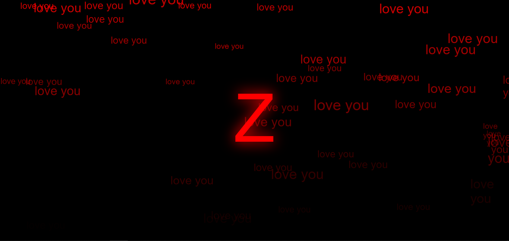
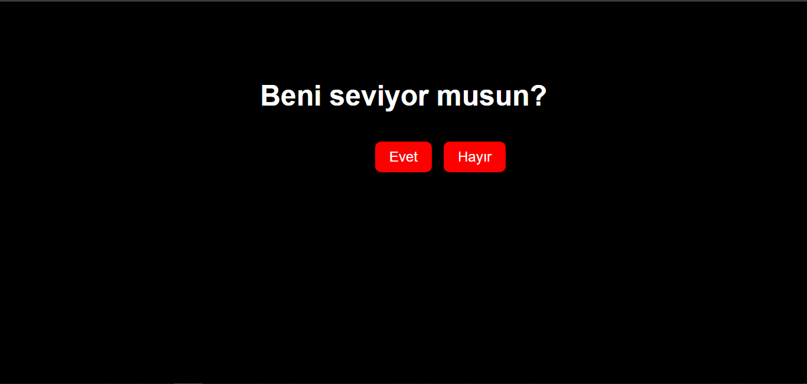

# Beni Seviyor Musun? - İnteraktif Web Sayfası

## Nasıl Çalışır?
- Sayfa yüklendiğinde büyük bir yazıyla “Beni seviyor musun?” sorusu ve iki buton (Evet / Hayır) görünür.  
- Kullanıcı "Hayır" butonunun üzerine fareyle yaklaşınca, buton rastgele konuma kaçar. Böylece "Hayır" demek neredeyse imkânsız olur.  
- Kullanıcı "Evet" butonuna tıkladığında:  
  - Soru ve butonlar kaybolur.  
  - Ekranda büyük kırmızı bir harf (örneğin "K") belirir ve parlama animasyonu başlar.  
  - Altında romantik bir yazı görünür.  
  - Arka planda gizli bir video/müzik otomatik oynatılır.  
  - Ekranda yukarıdan aşağıya “love you” yazıları yağmur gibi akar.  

---

## ⭐ Özellikler
- Kaçan buton efekti (fareyle üzerine gelince hareket eder)  
- Etkileşimli butonlar (Evet / Hayır)  
- Animasyonlu yazı efekti (parlayan harf ve alt yazı)  
- Arka planda sesli müzik/video oynatma  
- Ekranda düşen yazılar (“love you” animasyonu)  
- Karanlık tema (siyah arka plan, beyaz ve kırmızı renkler)  

---

## ✏️ Not
**99. satırda `Burayı düzenle.` yazan yere istediğin kelimeyi yazabilirsin.**

---

## 📷 Görüntüler

  

> Yukarıdaki görsel, “Evet” butonuna basıldıktan sonraki ekran görünümünü temsil eder.

---

## 💬 Destek & İletişim
- 💬 Destek Sunucusu: [https://discord.gg/YAEjW6drVY](https://discord.gg/YAEjW6drVY)  
- 👤 Geliştirici: **Zywexx**  
- ✉️ Sorularınız için DM atabilirsiniz!

---

## 📄 Lisans
Bu proje [GNU Genel Kamu Lisansı v3.0 (GPL-3.0)](https://www.gnu.org/licenses/gpl-3.0.tr.html) ile lisanslanmıştır.  
Yazılımı özgürce kullanabilir, değiştirebilir ve dağıtabilirsiniz; ancak aynı lisans şartlarına uymanız gerekir.

---
